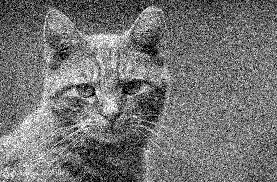
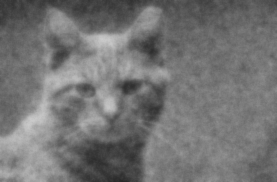

# Proyecto de Reducción de Ruido en Imágenes (Image Denoising)

## **Introducción**

Este proyecto se centra en la reducción de ruido en imágenes mediante técnicas de optimización numérica. El método utiliza matrices dispersas y un enfoque de inversión regularizada para minimizar el ruido en imágenes en escala de grises. Además, incluye herramientas para evaluar el ruido utilizando métricas como la Relación Señal-Ruido de Pico (**PSNR**, por sus siglas en inglés) y el Índice de Similitud Estructural (**SSIM**, por sus siglas en inglés).

El proyecto combina teoría matemática y computación aplicada, ofreciendo una solución práctica al problema del ruido en imágenes digitales.

## **Relación Teórica**

El ruido en las imágenes es un problema común, especialmente en condiciones como baja iluminación, sensores electrónicos imperfectos o errores en la transmisión de datos. En este proyecto, el ruido gaussiano se utiliza como modelo para simular este fenómeno. Este tipo de ruido sigue una distribución normal (campana de Gauss), que es ampliamente utilizada para modelar ruido en imágenes reales debido a su relevancia práctica.

### **Fundamentos del Proyecto**

1. **Ruido en Imágenes**:
   - El ruido gaussiano introduce pequeñas variaciones aleatorias en los valores de intensidad de los píxeles.
   - Su naturaleza estadística sigue una distribución normal, definida por una media $(\mu)$ y una desviación estándar $(\sigma)$.
   - Este tipo de ruido degrada la calidad visual y afecta tareas como segmentación y análisis.

2. **Reducción de Ruido Regularizada**:
   - La reducción de ruido se formula como un problema de optimización matemática, donde se busca encontrar una imagen suavizada minimizando una función objetivo que equilibra la fidelidad a la imagen original y la suavidad:

   $$\text{minimizar} \quad \| I_{\text{ruidosa}} - I_{\text{suavizada}} \|^2 + \lambda \| D_h I + D_v I \|^2$$

   Donde:
     - $I_{\text{ruidosa}}$: Imagen con ruido.
     - $I_{\text{suavizada}}$: Imagen denoised o suavizada.
     - $D_h$ y $D_v$: Matrices de diferencias horizontales y verticales que imponen regularización para evitar cambios bruscos entre píxeles.
     - $\lambda$: Parámetro de regularización que controla el equilibrio entre fidelidad y suavidad.

4. **Matrices Dispersas**:
   - Las operaciones de diferencias finitas $D_h$, $D_v$ se representan mediante matrices dispersas, optimizando el uso de memoria y reduciendo el costo computacional.

5. **Método de Gradiente Conjugado**:
   - La solución del problema de optimización resulta en un sistema lineal disperso de gran tamaño.
   - El método de gradiente conjugado, implementado en `scipy.sparse.linalg.cg`, permite resolver iterativamente este sistema de forma eficiente.

## **Características del Proyecto**

- **Simulación de Ruido**: Agrega ruido gaussiano a cualquier imagen de entrada en escala de grises.
- **Algoritmo de Reducción de Ruido**: Utiliza operaciones con matrices dispersas y regularización para reducir el ruido.
- **Métricas de Desempeño**: Calcula PSNR y SSIM para evaluar objetivamente la calidad de la imagen suavizada.
- **Herramientas de Visualización**: Muestra las imágenes original, ruidosa y suavizada para comparación visual.

## **Requisitos**

- Python 3.x
- Librerías necesarias:
  - OpenCV (`opencv-python`)
  - SciPy (`scipy`)
  - NumPy (`numpy`)
  - Scikit-image (`scikit-image`)
  - Matplotlib (`matplotlib`)

Instala las dependencias ejecutando (o instalalos desde `requirements.txt`):
```bash
pip install opencv-python scipy numpy scikit-image matplotlib
```

## **Cómo Funciona**

El flujo principal del proyecto incluye los siguientes pasos:

1. **Agregar Ruido a la Imagen**:
   - Se genera ruido gaussiano utilizando `np.random.randn` y se agrega a una imagen en escala de grises.

2. **Reducción de Ruido (Denoising)**:
   - Se define un modelo regularizado para suavizar la imagen, resolviendo un sistema disperso con gradiente conjugado.
   - Se utilizan matrices de diferencias horizontales y verticales para garantizar la suavidad.

3. **Evaluación de la Calidad**:
   - Se calculan las métricas PSNR y SSIM para medir la similitud entre la imagen original y la imagen suavizada.

## **Instrucciones de Uso**

1. Clona el repositorio:
   ```bash
   git clone https://github.com/Electromayonaise/image-denoising
   cd image-denoising
   ```

2. Prepara una imagen de entrada en escala de grises (por ejemplo, `cat.png`) y colócala en el directorio `data/`.

3. Ejecuta el script principal:
   ```bash
   python main.py
   ```

4. Salidas generadas:
   - `cat_noisy.png`: Imagen con ruido gaussiano.
   - `cat_denoised.png`: Imagen después de la reducción de ruido.

## **Ejemplo**

### **Imagen Original**


### **Imagen con Ruido**


### **Imagen Suavizada**


### **Desempeño**
- **PSNR**: Mide la similitud objetiva entre las imágenes.
- **SSIM**: Evalúa la similitud percibida en términos de estructura.

Ejemplo de salida:
```
PSNR: 30.25, SSIM: 0.85
```

## **Personalización**

- Ajusta el parámetro `lambda_param` en la función `denoise_image` para cambiar la fuerza de regularización.
- Modifica `noise_factor` en la función `add_noise` para simular diferentes niveles de ruido.

  

